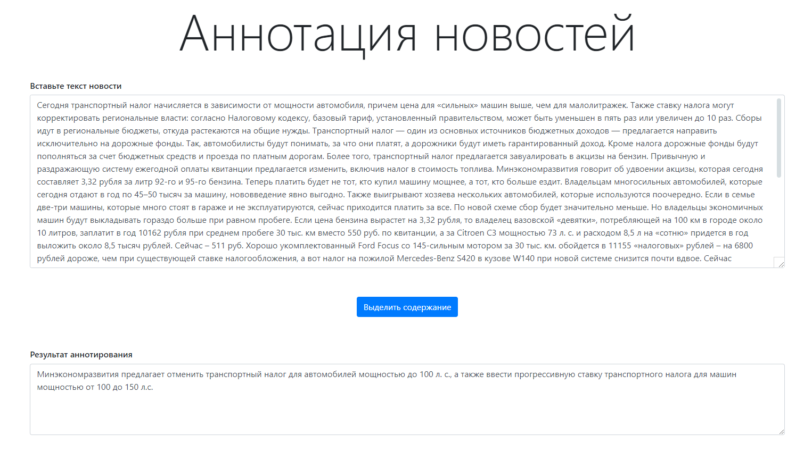

# Проект "Программная инженерия для приложений ИИ - Аннотация новостей"

* Решаемая задача: аннотирование текста
* Используемая модель: rugpt3medium_sum_gazeta
* Язык текста: русский
* Датасет на котором обучена модель: `Gazeta` - аннотация новостей на русском языке

**Облачная реализация**
* API и Web интерфейсы (Flask + js)
* Реализована очередь запросов (присваиваются ID и добавляются в очередь на вычисления)
* Отдельный файл настройки
* Развернуто в Yandex.Cloud (модель на CPU)

**ХОСТ: 51.250.4.66:5000**

Для того чтобы использовать модель просто добавьте адрес http://84.201.132.152:5000/ в браузерную строку.

>**ВНИМАНИЕ! Хост на yandex.Cloud чуть менее чем никакой - новость будет обрабатвыаться около минуты!**

## API
Для работы с API реализовано 2 эндпоинта:
* /send_text - POST для отправки текста
* /get_result - GET для получения результата

### Отправка
Для отправки текста необходимы следующие параметры:

```cli
type: "POST"
url: "http://84.201.132.152:5000/send_text",
data: data
processData: false
contentType: "text/plain"
```

Postman автоматичеки разберется, если выбрать `POST` $\rightarrow$ `RAW`

Пример для Ajax:

```js
$.ajax({
        type: "POST",
        url: "http://84.201.132.152:5000/send_text",
        data: data,
        processData: false,
        contentType: "text/plain",
        success: function(data, status, code) {...},
        error: function(status) {...}
})
```

В ответ сервер отдаст токен вида `ac03e5aa57321b981ebc98d6a0ce027662b5ccc88998d7089550b272d3a6c89f` **(ID)**, по
нему можно будет получить результат.

### Получение

Для проверки готовности результата нужно запросить `http://84.201.132.152:5000/get_result/` с параметром `id`.

Пример для Ajax:

```js
$.ajax({
        type: "GET",
        url: 'http://84.201.132.152:5000/get_result?id=' + ID,
        success: function(response, status, code) {
            if (status === "success"){
                // только 200 содержит ответ, 204 - еще не обработан
                ...
                return;
            }
            else{
                ...
                return;
            }
            
        },
        error: function(response, status){
            alert("Error: " + response + " " + status);
        }
})
```

Обратите внимание, что только `200` response code содержит данные с аннотацией, `204` - говорит о том, что текст с данным **ID** либо в очереди, либо вычисляется.

Postman - достаточно обратиться к `http://84.201.132.152:5000/get_result/` с ключом `id`

## Web

Реализован простой одностраничник.



## Локальный запуск модели

**Внимание** Пользвоательские файлы должны быть в кодировке **CP-1251**!

Работа со скриптом в 2 вариантах - заготовленный текст и текст из произвольного файла:

1. `python main.py`
2. `python main.py --file <filename>`


## Аргументы скрипта

* `--file` путь до файла с текстом, кодировка cp-1251. Путь должен быть абсолютным. Если не вызывать параметр, 
* будет прочитан стандартный файл
* `--device` устройство для вычислений, используется нотация `torch`: `cpu`, `cuda:0`, `cuda:1` и т. д. По умолчанию - считает на CPU.

## Пример работы

`python .\main.py --device cuda:0`

```bash
Use default text
Use cuda:0 device for inference
Article summary:
```

**Текст**

>Сегодня транспортный налог начисляется в зависимости от мощности автомобиля, причем цена для «сильных» машин выше, чем для малолитражек. Также ставку налога могут корректировать региональные власти: согласно Налоговому кодексу, базовый тариф, установленный правительством, может быть уменьшен в пять раз или увеличен до 10 раз. Сборы идут в региональные бюджеты, откуда растекаются на общие нужды. Транспортный налог — один из основных источников бюджетных доходов — предлагается направить исключительно на дорожные фонды. Так, автомобилисты будут понимать, за что они платят, а дорожники будут иметь гарантированный доход. Кроме налога дорожные фонды будут пополняться за счет бюджетных средств и проезда по платным дорогам. Более того, транспортный налог предлагается завуалировать в акцизы на бензин. Привычную и раздражающую систему ежегодной оплаты квитанции предлагается изменить, включив налог в стоимость топлива. Минэкономразвития говорит об удвоении акцизы, которая сегодня составляет 3,32 рубля за литр 92-го и 95-го бензина. Теперь платить будет не тот, кто купил машину мощнее, а тот, кто больше ездит. Владельцам многосильных автомобилей, которые сегодня отдают в год по 45–50 тысяч за машину, нововведение явно выгодно. Также выигрывают хозяева нескольких автомобилей, которые используются поочередно. Если в семье две-три машины, которые много стоят в гараже и не эксплуатируются, сейчас приходится платить за все. По новой схеме сбор будет значительно меньше. Но владельцы экономичных машин будут выкладывать гораздо больше при равном пробеге. Если цена бензина вырастет на 3,32 рубля, то владелец вазовской «девятки», потребляющей на 100 км в городе около 10 литров, заплатит в год 10162 рубля при среднем пробеге 30 тыс. км вместо 550 руб. по квитанции, а за Citroen C3 мощностью 73 л. с. и расходом 8,5 л на «сотню» придется в год выложить около 8,5 тысяч рублей. Сейчас – 511 руб. Хорошо укомплектованный Ford Focus cо 145-сильным мотором за 30 тыс. км. обойдется в 11155 «налоговых» рублей – на 6800 рублей дороже, чем при существующей ставке налогообложения, а вот налог на пожилой Mercedes-Benz S420 в кузове W140 при новой системе снизится почти вдвое. Сейчас владелец платит в год за 279 л. с. мотора около 41850 рублей. При среднем пробеге в 30 тыс. км в год и расходе топлива порядка 20 л на 100 км он истратит всего 6000 литров бензина и заплатит в казну вдвое меньше – 19920 рублей. С точки зрения власти решение отмены транспортного налога понятное и верное. В первую очередь, собираемость налога тут же возрастет до 100%, потому что новая система исключает возможность уклониться от уплаты. Кроме того, налоговая инспекция сэкономит бюджетные средства на доставке квитанций и судебных издержках при выколачивании средств с неплательщиков. Автоматически решается вопрос с бюрократической неразберихой после продажи машины или утилизации, когда налоговые органы присылают квитанцию на давно проданную машину. Но главное, что при новой схеме сборы значительно возрастут. Власти рассчитывают собирать до 62 млрд рублей в год. Экономисты уже предвидят тотальное повышение цен из-за роста стоимости перевозок. Ведь за бензин придется переплачивать и логистическим компаниям, которые включат дополнительные расходы в цену товара. Получается, что теперь за дороги будут платить не только автомобилисты, но и те, кто за рулем никогда не сидел. Но даже с учетом всех оговорок отмена транспортного налога — это важный и сильный политический шаг, который поможет снять напряжение в регионах. Дело в том, что скрытое налогообложение делает поборы незаметными и не травмирующими. Ведь власти и сейчас любят педалировать тем, что в стране самый низкий в Европе подоходный налог 13%. При этом они не афишируют другие отчисления в бюджет, которые снимаются с граждан с теми же акцизами и НДС. Есть также сомнения, что власти смогут обеспечить прозрачность расходования средств. Дорожные фонды в России уже существовали и были расформированы в 2000 году за коррупционность. Как предполагается распределять деньги между регионами и федеральным дорожным агентством и кто будет следить за потоками, в правительстве пока не решили.

**Аннотация**

>Минэкономразвития предлагает отменить транспортный налог для автомобилей мощностью до 100 л. с., а также ввести прогрессивную ставку транспортного налога для машин мощностью от 100 до 150 л.с.
